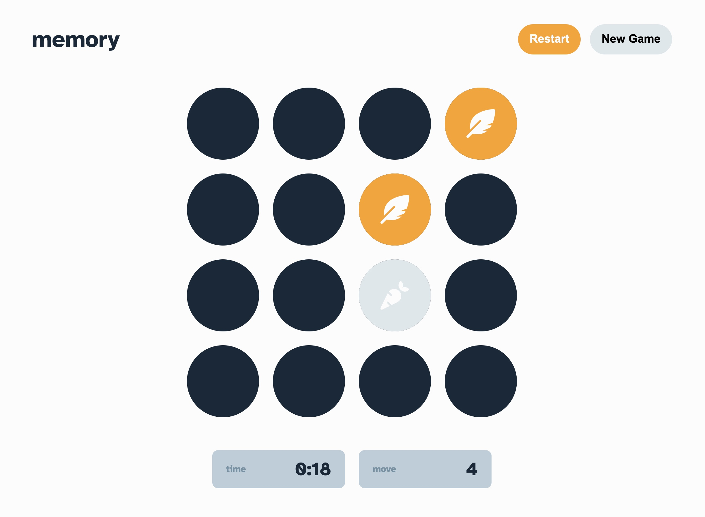

# Frontend Mentor - Memory game solution

This is a solution to the [Memory game challenge on Frontend Mentor](https://www.frontendmentor.io/challenges/memory-game-vse4WFPvM). Frontend Mentor challenges help you improve your coding skills by building realistic projects. 

## Table of contents

- [Overview](#overview)
  - [The challenge](#the-challenge)
  - [Screenshot](#screenshot)
  - [Links](#links)
- [My process](#my-process)
  - [Built with](#built-with)
  - [What I learned](#what-i-learned)
  - [Continued development](#continued-development)
- [Author](#author)

**Note: Delete this note and update the table of contents based on what sections you keep.**

## Overview

### The challenge

Users should be able to:

- View the optimal layout for the game depending on their device's screen size
- See hover states for all interactive elements on the page
- Play the Memory game either solo or multiplayer (up to 4 players)
- Set the theme to use numbers or icons within the tiles
- Choose to play on either a 6x6 or 4x4 grid

### Screenshot

### Links

- Solution URL: [Github](https://github.com/remyboire/memory-game)
- Live Site URL: [Github Pages](https://remyboire.github.io/memory-game/public/)

## My process

### Built with

- Flexbox
- CSS Grid
- Mobile-first workflow
- SASS

### What I learned

I challenged myself to code this game in one day, so it's definitely not perfect. I'm not very comfortable with class constructors, and I'm sure I can make it more clear and efficient. I really loved making the game mechanics.
My Sass structure is a mess, but I think the UI is ok, if I had more time I would have cleaned it a bit.
I wanted to hide any information on the HTML side, therefore it would have been easy to cheat with dev tools, so every card is rendered dynamically.

### Continued development

I didn't use localstorage to save the game state and it would be a good idea to do so in the future. I would also be nice to have a leaderboard.

## Author

- Website - [Rémy Boiré](https://www.remyboire.fr)
- Frontend Mentor - [@remyboire](https://www.frontendmentor.io/profile/remyboire)
